# Hylé Architecture & Design Decisions

Architectural principles, design trade-offs, and known issues.

**Quick Links:**
- [ROADMAP.md](ROADMAP.md) — Shipped, roadmap, phases
- [SECURITY_AUDIT.md](SECURITY_AUDIT.md) — Threat model, P0-P10 findings
- [DEPLOYMENT.md](DEPLOYMENT.md) — Operations, monitoring, runbooks
- [RELEASE_CHECKLIST.md](RELEASE_CHECKLIST.md) — Pre-ship checklist
- [CONTRIBUTING.md](CONTRIBUTING.md) — Dev setup, testing, PR workflow

---

## System Architecture

```mermaid
graph LR
    CLI["CLI<br/>Bun+TypeScript<br/>commands/"]
    Config["Config<br/>.hyle<br/>hyle.yaml"]
    RegistryAPI["Registry API<br/>Bun HTTP<br/>handlers/"]
    GitHubRaw["GitHub<br/>raw.githubusercontent.com<br/>blueprint files"]
    WebUI["Web UI<br/>Angular<br/>search/detail"]
    GitHub["GitHub OAuth"]
    Resend["Resend<br/>email service"]
    
    CLI -->|read/write| Config
    CLI -->|publish,pull,<br/>search| RegistryAPI
    RegistryAPI -->|fetch files| GitHubRaw
    RegistryAPI -->|verify author| GitHub
    RegistryAPI -->|send notifications| Resend
    WebUI -->|search,fetch| RegistryAPI
    WebUI -->|auth| GitHub
    
    style CLI fill:#42b983
    style RegistryAPI fill:#42b983
    style WebUI fill:#35495e
    style GitHub fill:#000
    style Resend fill:#ffc40e
    style GitHubRaw fill:#000
```



---

## Known Design Issues

Full details in [ARCHITECTURE_ISSUES.md](ARCHITECTURE_ISSUES.md) — here's a summary:

| Issue | Status | Details |
|-------|--------|---------|
| 1. Registry trust model | ⏳ Partial | Manifest scan covers behavioral keywords; needs blocking + diff preview (Phase 5D) |
| 2. Client lock-in | ❌ Not started | CLI scans don't find non-Claude clients; Phase 5D task |
| 3. `hyle watch --split` | ⏳ Proposed | Replace with `--budget` cost tracking (Phase 5D) |
| 4. GDPR audit trail | ⏳ Proposed | Move to enterprise extension (Phase 5D) |
| 5. Model-pin email | ✅ Resolved | Implemented as CLI warning on push + `hyle outdated` |
| 6. `hyle.json` weight | ⏳ Proposed | Switch to user-declared priority in hyle.yaml (Phase 5D) |
| 7. Private blueprints | ✅ Resolved | Private GitHub repos = private blueprints (by design, no extra work) |
| 8. No drift detection | ✅ Resolved | hyle.lock + outdated + upgrade + verify (v0.2.0) |
| 9. No CI integration | ✅ Resolved | `hyle verify` with exit codes (v0.2.0) |
| 10. No composition | ✅ Resolved | `extends` field implemented (v0.2.0) |

**Security findings:** See [SECURITY_AUDIT.md](SECURITY_AUDIT.md) for threat model, P0-P10 issues, and verification checklist.

---

## Architectural Constraints

1. **Core CLI is programmatic only**: no LLM required, no network call on every command, fast and scriptable
2. **Config lives in project or global `.hyle`**: not in `hyle.yaml` (manifest is for publishing)
3. **Four domains are orthogonal**: ontology (knowledge), craft (technical), identities (personas), ethics (constraints). A file belongs to exactly one domain
4. **Inheritance depth ≤ 2**: prevents opaque dependency chains
5. **Security is defense-in-depth**: scans + author tiers + pull warnings + user review (no single gate)
6. **GitHub is the file store**: Blueprints live on publishers' GitHub repos. Hylé registry stores only manifests + per-file checksums. On pull, files are fetched directly from GitHub (raw.githubusercontent.com)
7. **Publisher must own a GitHub repo**: A public GitHub repo is required to publish. The repo link is auto-detected from `git remote` (no extra setup after first push)
8. **Registry publish history is public**: publish history always visible, including flagged versions with reasons

---

## Model Configuration

Substrates declare both `primary` (complex tasks) and `secondary` (lightweight) models, each with independent fallback chains:

```yaml
models:
  primary:
    provider: anthropic
    model: "claude-sonnet-4-6"
    model_pin: "claude-sonnet-4-6-20260101"  # optional: pin exact checkpoint
    fallback:
      - provider: openai
        model: "gpt-4o"
      - provider: ollama
        model: "qwen2.5:14b"
```

Fallback resolution tries each entry in order; skips entries whose provider reports quota exhausted or is unreachable. Entries with `tags: [local, free]` are always tried last.

---

---


## See Also

- [README.md](README.md) — Product overview
- [CONFIG.md](CONFIG.md) — Configuration reference
- [ROADMAP.md](ROADMAP.md) — Roadmap, phases, shipped features
- [SECURITY_AUDIT.md](SECURITY_AUDIT.md) — Threat model, findings
- [DEPLOYMENT.md](DEPLOYMENT.md) — Operations, monitoring
- [CONTRIBUTING.md](CONTRIBUTING.md) — Dev setup, testing
- [RELEASE_CHECKLIST.md](RELEASE_CHECKLIST.md) — Pre-ship checklist
