# Hylé Deployment & Operations

Production deployment guide, monitoring, and incident response.

---

## Pre-Deployment

### Required Environment Variables

```bash
# Registry server (required)
PORT=3000
DB_PATH=/data/hyle-registry.db
BASE_URL=https://registry.hyle.dev
JWT_SECRET=$(openssl rand -hex 32)            # Generate new
HYLE_WEB_ORIGIN=https://app.hyle.dev          # Explicit, not wildcard
GITHUB_CLIENT_ID=your_github_oauth_app_id
GITHUB_CLIENT_SECRET=your_github_oauth_secret
FRONTEND_URL=https://app.hyle.dev
RESEND_API_KEY=your_resend_api_key
HYLE_RATE_LIMIT=10                            # publishes/hour

# Web frontend (Angular build-time)
ANGULAR_API_BASE_URL=https://registry.hyle.dev
ANGULAR_GITHUB_CLIENT_ID=same_as_registry
```

**Never hardcode. Use secret management:**
- GitHub Secrets (for CI/CD)
- AWS Secrets Manager (for production)
- `.env.local` in development (never commit)

### Infrastructure

```mermaid
graph LR
    Users["Users"]
    WAF["WAF<br/>CloudFlare"]
    LB["Load Balancer"]
    Registry["Registry<br/>Bun HTTP"]
    DB["SQLite<br/>/data/hyle.db"]
    GitHub["GitHub<br/>raw.githubusercontent.com<br/>blueprint files"]
    Email["Resend<br/>Email Service"]
    
    Users -->|HTTPS| WAF -->|Rate limit| LB -->|:3000| Registry
    Registry -->|Read/Write| DB
    Registry -->|Fetch files| GitHub
    Registry -->|Send notifications| Email
    
    style Registry fill:#42b983
    style DB fill:#90a4ae
    style GitHub fill:#000
    style Email fill:#ffc40e
```



### Pre-Deploy Checklist

**Week 1:**
- [ ] Staging environment (separate AWS account or namespace)
- [ ] HTTPS certificates (TLS 1.3+) for `registry.hyle.dev`
- [ ] WAF configured (CloudFlare or AWS WAF) with rate limiting
- [ ] CloudWatch or DataDog for logs + metrics
- [ ] Database backups (daily, 30-day retention, tested restore)
- [ ] DNS records for `registry.hyle.dev`, `api.hyle.dev`, `app.hyle.dev`
- [ ] SPF/DKIM/DMARC for Resend email

**Week 2:**
- [ ] Monitoring alerts configured
- [ ] On-call rotation established
- [ ] Incident runbooks written (see below)
- [ ] Rollback procedure tested
- [ ] Load test at 10x expected volume (see Performance section)

---

## Deployment Architecture

### Single-Node (v0.2.0)

Acceptable for beta. **Single point of failure.**

```
Internet → WAF (CloudFlare) → 1 Bun server (port 3000) → SQLite + disk
```

**Pros:** Simple, fast to deploy  
**Cons:** No HA, disk failure = data loss, no scaling

### Multi-Node (v0.3+)

Upgrade when demand exceeds single-node capacity.

```
Internet → WAF → Load Balancer → [Bun server 1] \
                                  [Bun server 2] → PostgreSQL + replication
                                  [Bun server 3] /
                                  
                                → Redis cache (search, sessions)
                                → S3 bucket (manifest backups)
```

**Pros:** HA, scales horizontally, data replicated  
**Cons:** Complexity, cost, PostgreSQL migration needed

---

## Monitoring & Observability

### SLO Targets (First 6 weeks)

| Endpoint | Metric | Target | Impact |
|----------|--------|--------|--------|
| `GET /substrates?q=...` | p99 latency | <500ms | Search latency |
| `GET /substrates/{author}/{name}@{version}` | p99 latency | <500ms | Detail page load |
| `POST /substrates` (publish) | p99 latency | <2s | Publish feedback |
| `GET /auth/github/callback` | p99 latency | <500ms | Login flow |
| Registry | Uptime | 99.5% | Availability |
| Database | Disk usage | <80% | Alert before full |

### Alerting Rules

```
ERROR RATE > 1%
  → Page oncall immediately

P99 LATENCY > 2 seconds
  → Page oncall (check CPU/memory/DB)

DATABASE DISK > 80%
  → Warn (not page); start cleanup

JWT_SECRET not set at startup
  → FAIL STARTUP (orchestration catches)

HYLE_WEB_ORIGIN not set at startup
  → FAIL STARTUP

Security scan pending > 60 seconds
  → Log warning (async OK for bundle, not manifest)
```

### Logging

**Always log:**
- All authentication attempts (login, publish, token refresh)
- All security scan findings (flagged/warning substrates)
- All manifest publishes (author, version, timestamp)
- All rate limit rejections (IP, endpoint, reason)
- All errors (stack trace, context, user)

**Do NOT log:**
- Bearer tokens or JWT secrets
- User passwords
- API keys
- Full manifest content (log size instead)

**Format:** Structured JSON (machine-parseable)

```json
{
  "timestamp": "2026-05-21T14:23:00Z",
  "level": "info",
  "event": "substrate_published",
  "author": "jane-doe",
  "substrate": "claude-typescript@1.0.0",
  "size_bytes": 48000,
  "scan_status": "pending"
}
```

---

## Incident Response Playbooks

### Scenario 1: Malicious Substrate Published

**Indicator:** Security scan flags substrate as critical (eval, exfiltrate, webhook keywords)

**Response (5 min):**
1. Get substrate ID: `SELECT id, author, name, version FROM substrates WHERE scan_status='flagged'`
2. Mark hidden: `UPDATE substrates SET is_flagged=1, flag_reason='Manual: behavioral keywords detected' WHERE id=123`
3. Announce in Slack: `#incidents` channel with substrate name, author, finding
4. Do NOT delete (retain for audit trail + learning)
5. Query who pulled it: `SELECT COUNT(*) FROM pull_logs WHERE substrate_id=123` (if tracking enabled)

**Post-Incident (1 day):**
- Notify affected users (email: "substrate you pulled was flagged")
- Post-mortem: Why did async scan miss it? Should have been blocking.
- Review keyword list (did we search for new vectors?)

**Prevention:** See [SECURITY_AUDIT.md](SECURITY_AUDIT.md) for behavioral keyword expansion.

---

### Scenario 2: Database Corruption or Disk Full

**Indicator:** Database errors in logs, registry returns 500 on GET, publish blocked

**Response (30 min):**
1. Switch to read-only mode: Return 503 for all POST requests
   ```
   HealthCheck status: "read_only" (alerts team automatically)
   ```
2. Restore from backup (RTO: 1 hour from last backup)
   ```bash
   sqlite3 /data/hyle-registry-backup.db .schema | sqlite3 /data/hyle-registry.db
   # Verify checksums match
   ```
3. Resume normal operation
4. Post-mortem: Why wasn't backup tested? (weekly restore tests required)

**Prevention:** Automated daily backups, weekly restore drills.

---

### Scenario 3: Auth Token Compromise

**Indicator:** Suspicious activity (mass publishes from single token, admin account locked)

**Response (1 hour):**
1. Rotate JWT_SECRET:
   ```bash
   export JWT_SECRET=$(openssl rand -hex 32)
   # Redeploy registry
   ```
2. Announce: *"All JWT tokens invalidated. Please re-login."*
3. Reset affected user accounts (force re-auth)
4. Audit: Which tokens were issued? Who accessed with them?
5. Rotate GITHUB_CLIENT_SECRET as well (GitHub OAuth app settings)

**Prevention:** Monthly credential rotation. Alert on simultaneous logins from different IPs.

---

### Scenario 4: DDoS Attack

**Indicator:** Traffic spikes 10x normal, all requests timing out, error rate >50%

**Response (5 min):**
1. Enable WAF rate limiting aggressively
   - CloudFlare: 10 req/sec per IP
   - Alert but don't block legitimate users
2. Assess: Is traffic legitimate (search spike) or attack?
   - Check IP geo distribution (attackers often from few countries)
   - Check User-Agent (bots vs browsers)
3. Mitigate:
   - Block known attacker IPs (WAF allowlist)
   - Enable CAPTCHA on search endpoint
   - Enable IP allowlist (whitelist known users)
4. Scale horizontally (if legitimate surge):
   - Add Bun server instances behind load balancer
   - Monitor auto-scaling metrics

**Prevention:** Load test at 10x volume before launch. WAF rules tuned for false-positive rate <1%.

---

### Scenario 5: Registry Service Down (500 errors)

**Indicator:** All endpoints return 500, logs show crash

**Response (2 min):**
1. Check service status:
   ```bash
   curl https://registry.hyle.dev/health → should return { status: "ok", version: "0.2.0" }
   ```
2. View recent logs: `tail -50 /var/log/hyle-registry.log`
3. If crash (OOM, crash loop):
   - Restart service: `systemctl restart hyle-registry`
   - Monitor for re-crash
4. If persistent:
   - Rollback to last known-good version
   - Trigger incident postmortem

**Prevention:** Health check endpoint. Auto-restart on crash (systemd). Liveness probes on load balancer.

---

## Day 1 Post-Deployment (30 min monitoring)

```bash
# 1. Health check
curl https://registry.hyle.dev/health
# Expected: { "status": "ok", "version": "0.2.0" }

# 2. Web UI loads
curl https://app.hyle.dev -s | head -20
# Expected: HTML, no JS errors

# 3. Test publish
hyle login --registry https://registry.hyle.dev
hyle push  # test substrate

# 4. Test search
hyle search hyle
# Expected: test substrate appears

# 5. Test pull
hyle pull org/test-substrate
# Expected: extracts successfully, hyle.lock created

# 6. Tail logs
tail -f /var/log/hyle-registry.log
# Expected: no ERROR or WARN lines
```

**If any fail:** Rollback immediately, post-mortem same-day.

---

## Long-Term Operations (Months 1–6)

### Week 1–4: Stabilize

- Monitor for errors, false-positive scans, DDoS
- Respond to user-reported issues (<1 hour SLA)
- Rotate credentials monthly
- Weekly log review (spot trends)

### Week 5–8: Optimize

- Analyze search latency: add indexes if p99 > 500ms
- Monitor bundle sizes: warn users if > 50MB
- Cache layer? (Redis) if search > 100k QPS
- Migrate bundles to S3 if disk approaching 70%

### Week 9–12: Harden

- Load test at 10x volume
- Test disaster recovery (restore from backup)
- Add multi-node deployment (PostgreSQL + replicas)
- Enable security headers (CSP, HSTS, X-Frame-Options)

### Week 13+: Scale

- Multi-region deployment (if global users)
- Private registry support (enterprise demand)
- Advanced analytics (download trends, substrate lifecycle)
- Dependency graph visualization

---

## Disaster Recovery

### RTO/RPO Targets

| Scenario | RTO | RPO |
|----------|-----|-----|
| Single-node disk failure | 1 hour | 1 day (last backup) |
| Registry service crash | 5 min (auto-restart) | 0 min (RAM cache) |
| Database corruption | 2 hours (restore + verify) | 1 day |
| Security incident (token leak) | 30 min (rotate secret) | 0 min |

### Backup Strategy

```bash
# Daily backup (cron job at 2 AM UTC)
sqlite3 /data/hyle-registry.db ".backup /backups/hyle-registry-$(date +%Y%m%d).db"

# Retention: 30 days
find /backups -name "hyle-registry-*.db" -mtime +30 -delete

# Weekly restore test (simulate production restore)
sqlite3 /backups/hyle-registry-latest.db "SELECT COUNT(*) FROM substrates;"
# Alert if count doesn't match production
```

### Rollback Procedure

**If v0.2.0 has critical bug:**

1. Identify last known-good version (v0.1.9)
2. Tag current as `v0.2.0-broken` (preserve for analysis)
3. Deploy v0.1.9: `git checkout v0.1.9 && bun run build`
4. Restart: `systemctl restart hyle-registry`
5. Verify: health check + smoke tests
6. Announce: Rolled back, investigating
7. Post-mortem: How did this get to prod? (CI gate failure?)

**Time: ~10 minutes.** Requires:
- Previous version built and tested
- Rollback documented in runbook
- Team familiar with deployment process

---

## Success Metrics (First 6 weeks)

| Metric | Target | Action if missed |
|--------|--------|------------------|
| Uptime | 99.5% | Page oncall if <99%; root-cause post-mortem |
| Search p99 latency | <500ms | Add database indexes or caching |
| Publish latency | <2s | Profile handler; check manifest scan time |
| Security incidents | 0 | Immediate investigation + containment |
| False positive scans | <5% | Keyword list review + expand |
| User signups | 100+ | Announce on social; reach out to early users |
| Substrates published | 50+ | Real usage signal; good health indicator |

---

**Document version:** v0.2.0  
**Last updated:** 2026-05-21  
**Maintained by:** Ops team  
**Review cycle:** Monthly (or post-incident)
