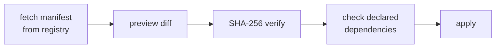
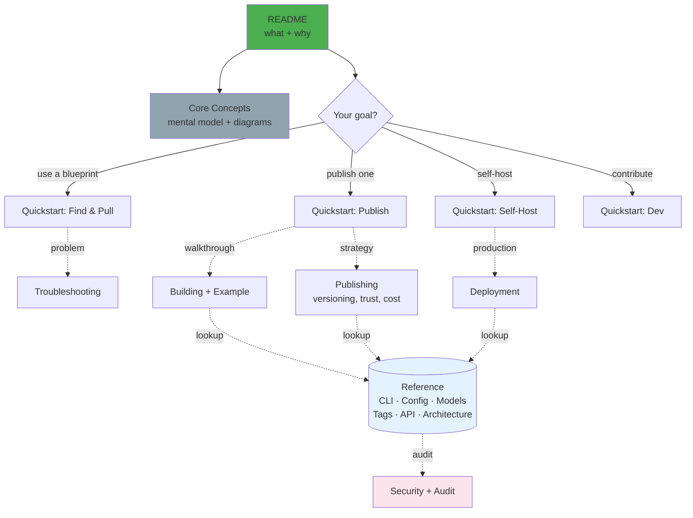

# Hylé

> ⚠️ **WIP — unreleased.** No public release (CLI `0.1.0`), no package-manager distribution, no hosted registry yet. Run the stack locally to try it → **[QUICKSTART.md](web/docs/QUICKSTART.md)**.

**Blueprint manager for LLM-powered projects** — like Docker Hub for AI agent configs. Pull best-practice AI workflows (CLAUDE.md, agents, policies, MCP configs, docs) or publish your own.

```bash
hyle pull author/blueprint-name     # Install latest blueprint
hyle push                           # Publish your own (auto-versioning)
```


- **Programmatic core** — `pull` / `push` / `init` need no LLM, work offline.
- **Registry-indexed** — metadata in Hylé's registry for fast search.
- **Open source** — source on GitHub for trust + transparency.
- **From templates to custom setups** — see what the community shares, or share your own.

---

## Quick Start

No installers yet — build from source and link the `hyle` command:

```bash
docker compose up --build      # web → :8080, registry → :3000, auth=none
cd cli && bun run link         # builds dist/hyle.js, links bare `hyle` onto PATH
hyle --help
```

Don't want to link? Run from source: `bun run cli/src/index.ts <command>`.

> ⓘ **Local registry starts empty** — nothing to `pull` until something is published. To try the full loop, `push` a blueprint of your own first, or point `remote_url` at a registry with content.

| Need | Doc |
|------|-----|
| Local-test → deploy walkthrough | **[QUICKSTART.md](web/docs/QUICKSTART.md)** |
| Dev setup | [DEV_QUICK_START.md](web/docs/guides/DEV_QUICK_START.md) |
| Package-manager installers (brew/choco/apt) | [backlog](web/docs/BACKLOG.md) |

### Prerequisites

| Tool | Min | Why |
|------|-----|-----|
| **[Bun](https://bun.sh)** | ≥ 1.0 | Runs CLI + registry |
| **[Docker](https://docs.docker.com/get-docker/) + Compose** | — | Runs local stack |
| **Git** | — | Runtime for `pull`; `push` tags releases |
| **Node** | ≥ 18 | Only to build npm/standalone CLI artifacts |

**Auth is optional.** Self-hosted local registry runs `auth=none` by default — no account needed. Auth applies only when targeting a registry that enabled it. Modes: **GitHub OAuth** (`github`, used by CLI `login`) and **generic OAuth2/OIDC** (`oauth2`, for GitLab etc. via manual config).

---

## Use Blueprints

```bash
hyle search java spring tdd                       # by tag
hyle search react typescript claude               # mix tags + LLM recommendations
hyle pull author/blueprint-name                   # install (name from search)
hyle pull author/blueprint-name@1.0.0 --dry-run   # preview diff before applying
```

`author/blueprint-name` is a placeholder — substitute a name from `hyle search`.

**Pull flow:**



Manifests indexed in registry for search; source code pulled from GitHub.

---

## Publish Blueprints

```bash
hyle init             # generate hyle.yaml (version 0.1.0)
hyle snapshot         # patch bump + "-snapshot" suffix (WIP, unstable)
hyle push             # minor bump, stable   e.g. 0.1.0 → 0.2.0
hyle release          # major bump, stable   e.g. 0.2.0 → 1.0.0
hyle push 1.2.3       # override: publish exact version, no auto-bump
```

| Command | Bump | Stable | Notes |
|---------|------|--------|-------|
| `snapshot` | patch + `-snapshot` | ✗ | WIP sharing |
| `push` | minor | ✓ | Default publish |
| `release` | major | ✓ | Lower numbers reset to zero |

`init` writes `version: 0.1.0`, so first bare `push` → `0.2.0`. Pass an explicit version to set it exactly. New version is written back to `hyle.yaml` after each publish.

### Your manifest is the allowlist

A blueprint is **not** your whole repo. `hyle.yaml` lists exact paths to publish — only those files ship, nothing else. Sit inside a 500k-line monorepo or private codebase and still publish a clean, focused blueprint. Source, secrets, build artifacts, unrelated code stay put.

Paths group into four categories:

```yaml
# hyle.yaml
name: claude-springboot-tdd
author: yourname

ontology:                           # knowledge docs
  - CLAUDE.md
  - docs/architecture/overview.md
craft:                              # technical structure
  - .mcp/servers.json
  - SKILLS.md
identities:                         # agent roles
  - .claude/agents/reviewer.md
  - .claude/agents/test-writer.md
ethics:                             # policies & compliance
  - policies/data-access.cedar
```

Only those files get packaged. Two ways to fill the manifest:

- **Manual** — list paths yourself for full control.
- **Scan helpers** — `hyle ontology|craft|identities|ethics [path]` scan a directory and append matching files, so you opt files *in*.

Add **`.hyleignore`** (gitignore-style) as a second guard to exclude keys, secrets, or private docs even if a path or scan catches them.

Each blueprint also declares `recommendations` (LLMs the author tested — feedback, not enforced) and `dependencies` (node, npm, python…). On `pull`, Hylé verifies dependencies exist before applying.

---

## Architecture

Three services, one docker-compose stack. Same images deploy anywhere (on-prem, AWS/GCP/Azure).

| Service | Stack | Role |
|---------|-------|------|
| **CLI** | Bun + TS (`cli/`) | `init` / `pull` / `push` — no LLM, offline-capable |
| **Registry** | Bun + TS + SQLite (`registry/`) | Blueprint API; enforces `name+author+version` uniqueness; `auth=none` default |
| **Web** | Angular 21 (`web/`) | Search, blueprint detail, docs viewer |

Auth opt-in (GitHub OAuth / generic OIDC). Details → **[ARCHITECTURE.md](web/docs/reference/ARCHITECTURE.md)**.

**Self-hosted & open source** — free FOSS, run the registry on your own infra. No vendor lock-in; infrastructure costs only (like self-hosted GitLab/Artifactory/Jenkins).

---

## Documentation

Layered: **orient → quickstart → guide → reference.** Read down only as far as your task needs. Start with [Core concepts](web/docs/CONCEPTS.md) for the mental model (all diagrams live there).



| I want to… | Start here | Go deeper |
|---|---|---|
| **Understand Hylé** | [Core concepts](web/docs/CONCEPTS.md) | — |
| **Use a blueprint** | [search & pull](web/docs/reference/CLI_COMMANDS.md) | [Troubleshooting](web/docs/guides/TROUBLESHOOTING.md) |
| **Publish a blueprint** | [Building](web/docs/guides/BUILDING.md) | [Publishing](web/docs/guides/PUBLISHING.md) · [Example](web/docs/guides/EXAMPLE_BLUEPRINT.md) |
| **Self-host the registry** | [Self-host quickstart](web/docs/operations/DEPLOYMENT_QUICK_START.md) | [Production deployment](web/docs/operations/DEPLOYMENT.md) |
| **Contribute code** | [Dev quick start](web/docs/guides/DEV_QUICK_START.md) | [Contributing](web/docs/guides/CONTRIBUTING.md) |

**Reference** (look up, don't read end-to-end): [CLI Commands](web/docs/reference/CLI_COMMANDS.md) · [Configuration](web/docs/reference/CONFIG.md) · [Models](web/docs/reference/MODELS.md) · [Tags](web/docs/reference/TAGS.md) · [Architecture](web/docs/reference/ARCHITECTURE.md) · [Registry API](web/docs/reference/REGISTRY_API.md) · [Known limitations](web/docs/reference/KNOWN_LIMITATIONS.md)

**Security:** [Policy](web/docs/security/SECURITY.md) · [Audit](web/docs/security/SECURITY_AUDIT.md) — **Roadmap:** [Backlog](web/docs/BACKLOG.md)
