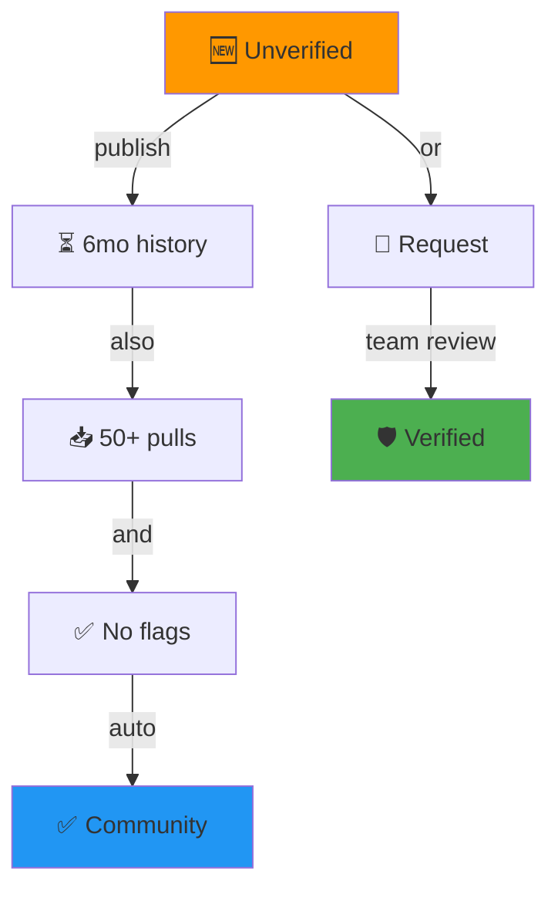
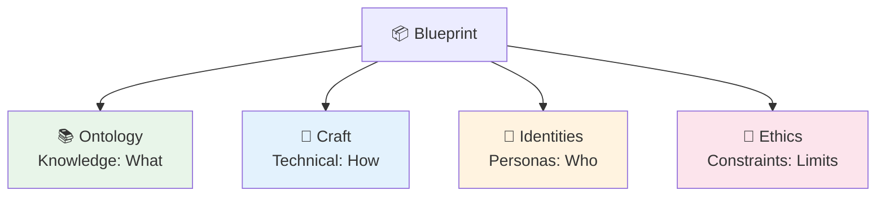
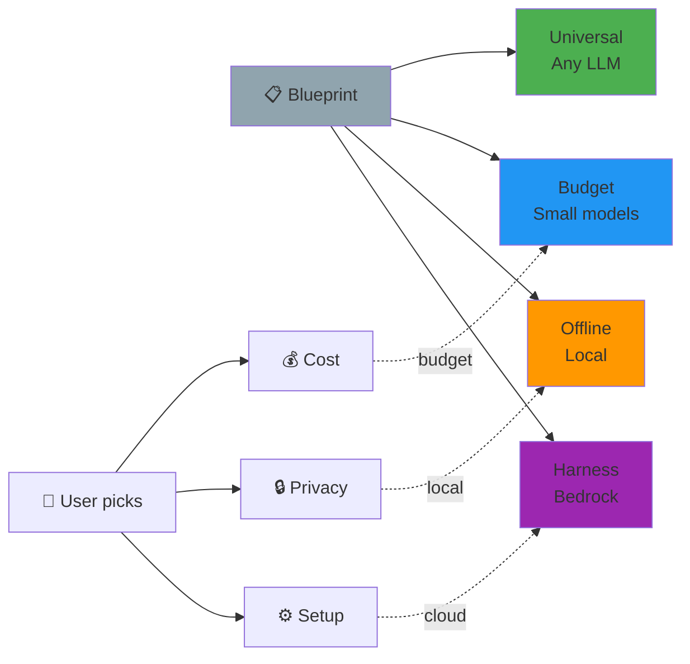
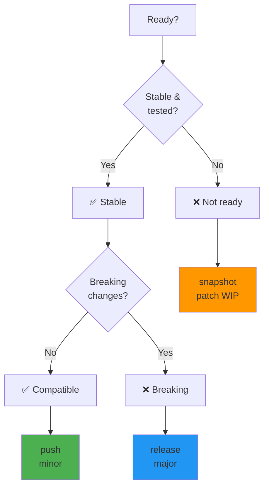

# Core Concepts

Visual guides to key Hylé concepts.

---

## User Journey: Search → Pull → Apply

How blueprints flow from registry to your project.

```mermaid
graph LR
    Search["🔍 Search<br/>hyle search java"]
    Registry["📦 Registry"]
    Results["📋 Results<br/>Pick blueprint"]
    DryRun["🔎 Preview<br/>hyle pull --dry-run"]
    Review["👁️ Review<br/>Inspect diff"]
    Apply["✅ Apply<br/>hyle pull"]
    Verify["🔐 Verify<br/>Deps & checksums"]
    Done["✨ Ready<br/>Blueprint loaded"]
    
    Search -->|query| Registry
    Registry -->|matches| Results
    Results -->|select| DryRun
    DryRun -->|show| Review
    Review -->|approve| Apply
    Apply -->|run| Verify
    Verify -->|ok| Done
    
    style Registry fill:#90a4ae
    style Apply fill:#4caf50
    style Verify fill:#2196f3
    style Done fill:#4caf50
```



**Key moments:**
- `hyle search` — queries registry metadata (fast, local cache)
- `hyle pull --dry-run` — shows diff WITHOUT applying (inspect before committing)
- `git diff` — see exact changes (git history preserved)
- `hyle verify` — sanity check (deps, checksums, models available)

---

## Trust Tiers: How Authors Build Credibility



**What unlocks at each tier:**

| Tier | Requirements | Means |
|------|---|---|
| 🆕 **Unverified** | New author | No history; assume caution |
| ✅ **Community** | 50+ pulls + 6mo + no flags | Auto-promoted; trusted by community |
| 🛡️ **Verified** | OAuth + manual Hylé team review | Official endorsement |

---

## Four Domains: What Goes Where?

Blueprint splits files into 4 orthogonal categories. Each file belongs to exactly one.



**Decision matrix: Where does each file go?**

| File | Domain | Why |
|------|--------|-----|
| CLAUDE.md | Ontology | Describes project context (knowledge) |
| AGENTS.md | Identities | Defines agent roles + personas |
| ARCHITECTURE.md | Craft | Technical design (how to build) |
| package.json | Craft | Dependencies + build config (how) |
| .cedar policies | Ethics | Access control + constraints (limits) |
| spec.pdf | Ontology | Domain knowledge (what) |
| .mcp.json | Craft | Tool integration (how to wire) |
| PRIVACY.md | Ethics | Data handling policy (limits) |

**Key principle:** Domains are **orthogonal** — no overlap. A file goes in ONE place.

---

## Model Compatibility: Choosing Your LLM

Blueprint declares recommended LLMs (tested, not enforced). Users choose which to use.



**How to declare:**

```yaml
recommendations:
  universal:
    - anthropic/claude-sonnet-4-6
    - openai/gpt-4o
    - ollama/qwen2.5:14b
  
  budget:
    - anthropic/claude-haiku-4-5
    - openai/gpt-4o-mini
  
  offline:
    - ollama/qwen2.5:14b
  
  harness:
    - bedrock/anthropic.claude-3-sonnet
    - cursor/claude-sonnet-4-6
```

**Search & filter:**
```bash
hyle search --tag budget       # Only blueprints tagged budget-friendly
hyle search --tag bedrock      # Only blueprints tagged Bedrock-compatible
```

**If no `recommendations` block:** Assumes `universal` (works everywhere).

---

## Publish Decision Tree: snapshot vs push vs release

When should you use each command?



**Quick checklist:**

```
Only docs changed? → hyle push (minor)
New feature, old code works? → hyle push (minor)
Removed/renamed agent? → hyle release (major)
Still testing? → hyle snapshot (patch, WIP)
```

---

## See Also

- [CONFIG.md](reference/CONFIG.md) — Domains explained in detail + patterns
- [PUBLISHING.md](guides/PUBLISHING.md) — Publishing strategy + trust model
- [PUBLISHING_QUICKSTART.md](guides/PUBLISHING_QUICKSTART.md) — Step-by-step walkthrough
