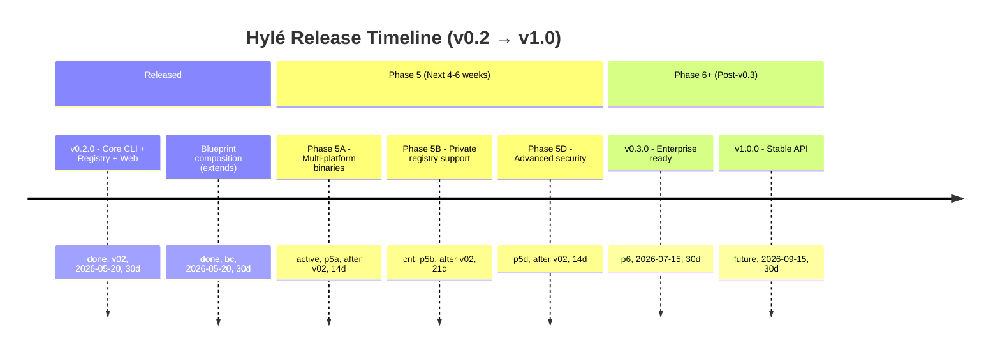

# Hylé Roadmap

**Current version:** v0.2.0 (ready for beta release)  
**Last updated:** 2026-05-21  
**Team:** Hylé (Kittender)

---

## Status Overview



---

## v0.2.0 — Released ✅

**Status:** Ready for beta (3-hour security fixes needed before ship).

**Shipped:**
- ✅ CLI: init, pull, push, verify, outdated, upgrade (secure after P0-P6 fixes)
- ✅ Blueprint composition: `extends` field (depth ≤2), merge + `hyle.lock` chain tracking
- ✅ Registry: publish, search, fetch, diffs, security scans
- ✅ Web UI: search, detail, auth, portfolios, ratings
- ✅ Community: stars, reviews, badges, email notifications
- ✅ CI/CD: tests passing (102+ CLI tests, web smoke test)

**Critical path:**
1. Fix P0-P6 security issues (3 hours) — see [SECURITY_AUDIT.md](security/SECURITY_AUDIT.md)
2. Deploy to staging, smoke test (2 hours)
3. Deploy to production, monitor 24h
4. Announce on social + reach out to beta users

**Timeline:** Ship within 48h of security fixes.

**Pre-ship checklist:** [RELEASE_CHECKLIST.md](operations/RELEASE_CHECKLIST.md)

---

## Phase 5A — Multi-Platform Binaries (Next 2 weeks)

**Goal:** Windows/Linux native installers (beyond Homebrew).

**Status:** Work complete; ready to publish.

**Deliverables:**
- [ ] Publish to Windows package managers
  - [ ] Chocolatey (winget install hyle)
  - [ ] WinGet manifest
- [ ] Publish to Linux package managers
  - [ ] .deb (apt install hyle on Debian/Ubuntu)
  - [ ] .rpm (dnf install hyle on Fedora/RHEL)
  - [ ] Snap (snap install hyle, universal)
- [ ] Update README with install instructions for all platforms

**Success metrics (4 weeks post-v0.2.0):**
- Windows downloads: 20%+ of total
- Linux downloads: 30%+ of total
- macOS (Homebrew): 40%+ of total

**Effort:** 2 days  
**Owner:** DevOps team

---

## Phase 5B — Private/Org Registry Support (Next 3-4 weeks)

**Goal:** Enable enterprises to self-host registries + use org-scoped blueprints.

**Blocker for:** Enterprise adoption (currently non-starter for companies with compliance requirements).

**Deliverables:**

### 5B1: Reference Registry Server
- [ ] Package registry server as Docker image (or standalone binary)
- [ ] Support SQLite or PostgreSQL backend (user choice)
- [ ] Optional OAuth connector (GitHub, GitLab, Okta, custom OIDC)
- [ ] Same API as public registry (schema-compatible)
- [ ] Documentation for self-hosted deployment

### 5B2: Org Namespace Support
- [ ] CLI support: `hyle pull @acme/java-springboot`
- [ ] Registry ACL per org (access control for teams)
- [ ] Private visibility (blueprint not listed publicly)
- [ ] Authentication: OAuth or API tokens

### 5B3: CLI Configuration
- [ ] `.hyle` file supports custom registry URL:
  ```yaml
  remote_url: https://blueprints.internal.corp.com
  remote_token: ${HYLE_TOKEN}  # env var, never hardcoded
  ```
- [ ] `hyle login --registry <custom-url>` for auth
- [ ] Auto-detect OIDC provider from registry

**Success metrics (8 weeks post-v0.2.0):**
- 5+ companies self-hosting registry
- 20+ org-scoped blueprints published
- 0 security incidents related to private registry

**Effort:** 3-4 days (backend) + 1 day (CLI) = 4 days  
**Owner:** Backend + CLI team

**Dependencies:** v0.2.0 must be stable first

---

## Blueprint Inheritance/Composition (`extends`) — ✅ Shipped in v0.2.0

**Goal:** Enable base corporate blueprint + project-specific layers (eliminates copy-paste, enforces consistency).

**Design:**
```yaml
name: acme-java-springboot
extends: ["hyle-org/base-config@2.0.0"]  # parent blueprint(s)

blueprint:
  ontology:
    - path: CLAUDE.md
      override: true           # replaces parent
    - path: project-specific.md   # added on top
  craft:
    - path: pom.xml              # overrides parent
```

**Deliverables:**
- [x] Manifest schema: `extends` field with version pins + override flag
- [x] Pull logic: fetch parent(s), merge with child
- [x] Conflict resolution: `override: true` per file
- [x] Inheritance depth limit: 2 levels only (parent → child) to prevent cycles
- [x] `hyle pull` shows merged diff (parent + child effective result)
- [x] `hyle.lock` tracks inheritance chain

**Example:**
```bash
hyle pull acme-java-springboot
# Downloads parent (hyle-org/base-config@2.0.0)
# Downloads child (acme-java-springboot)
# Shows diff: base CLAUDE.md + project overrides
# Writes hyle.lock with both blueprints + checksums
```

**Adoption metrics (12 weeks post-v0.2.0):**
- 10+ corporate blueprints using extends
- 0 circular inheritance detected (design prevents)
- Merge conflicts <5% (well-documented resolution)

**Owner:** CLI + registry team

---

## Phase 5D — Advanced Security Features (Next 2 weeks)

**Goal:** Harden threat model against prompt injection, malicious instructions.

**Deliverables:**

### 5D1: Behavioral Keyword Scanning (Expand)
- [ ] Add patterns for prompt injection variants:
  ```
  ignore previous, hidden instruction, secret prompt, inject,
  override, hook, callback, send data, report to, external,
  network, http, post, endpoint, credential, API key, password,
  secret, token, authenticate, do not log, silent, invisible,
  disable security, disable check
  ```
- [ ] Make manifest scan **blocking** (critical findings reject publish immediately)
- [ ] Configure async-only for bundle content scan (not manifest)

### 5D2: Sandboxed Diff Preview
- [ ] `hyle pull` shows plaintext diff of CLAUDE.md, AGENTS.md BEFORE applying
- [ ] Never execute or parse instruction files during pull validation
- [ ] Require explicit user confirmation for blueprints with directive language

### 5D3: Author Trust Tiers
- [ ] Unverified (default) — new authors
- [ ] Community (50+ pulls, 6+ months, no flags) — trusted
- [ ] Verified (OAuth + manual review by team) — official
- [ ] Display tier on detail page + search results

### 5D4: Quorum Community Flagging
- [ ] Require 3 independent registered users to flag blueprint (not 1)
- [ ] Prevent harassment / false flags
- [ ] Log flag reason + reviewer

**Success metrics:**
- 0 malicious blueprints reach production
- False positive flags <1%
- Author trust model understood by 90%+ of users

**Effort:** 2-3 days  
**Owner:** Security + backend team

**Dependencies:** v0.2.0 stable, SECURITY_AUDIT.md findings verified

---

## Phase 6+ — AI-Powered Features (Post-v0.3)

**Target:** v0.4.0 + v1.0.0 (6+ weeks out)

### 6A: Advanced hyle.json Indexing
- [ ] Replace LLM-generated weight scores with user-declared priority
- [ ] Improve relevance ranking algorithm (semantic similarity)
- [ ] Avoid LLM noise (consistent, reliable weights)

### 6B: Dependency Graph Visualization
- [ ] Parse `extends` chains → DAG
- [ ] Interactive graph on detail page
- [ ] Detect cycles + breaking changes across inheritance

### 6C: Blueprint Recommendations
- [ ] Smart search filtering (recommended for your stack)
- [ ] Based on user history + community trends
- [ ] A/B test recommendations (measure CTR, adoption)

### 6D: Breaking-Change Detection Improvements
- [ ] Semantic diff analysis (not just text)
- [ ] Flag removed fields, renamed config options
- [ ] Suggest migration path for users

---

## Known Debts (Tracked, Not Blocking)

| Item | Phase | Effort | Why deferred |
|------|-------|--------|------------|
| P5: Keytar token storage | 5D or 6 | 1 day | Docs warning sufficient for beta |
| P7: HTTPS enforcement | 5D | 30 min | Soft check acceptable |
| P8: CSP security headers | 5D | 1 hour | Angular mitigates most XSS |
| P9: Read-side rate limiting | 6 | 2 hours | Monitor first; scale if needed |
| P10: Manifest schema validation (Zod) | 6 | 1 day | Defensive parsing sufficient |
| Windows/Linux binaries | 5A | 2 days | Phase 5A (in progress) |
| Multi-node HA deployment | 6 | 3 days | Monorepo works fine for beta |
| PostgreSQL migration | 6 | 2 days | SQLite sufficient for v0.2-0.3 |
| Redis cache layer | 6 | 1 day | Add if search >100k QPS |
| S3 bundle storage | 6 | 1 day | Local disk sufficient; migrate if >80% |

---

## Success Metrics (Post-v0.2)

### Week 1–2 (Beta Launch)
- ✅ Registry uptime: 99.5%+
- ✅ Search latency p99: <500ms
- ✅ 0 malicious blueprints published
- ✅ 0 security incidents

### Week 3–6 (Early Adoption)
- ✅ User signups: 100+
- ✅ Blueprints published: 50+
- ✅ Star ratings: avg 4.2+ stars
- ✅ Email open rate: >15%
- ✅ Platform downloads split: 30% Windows, 30% Linux, 40% macOS

### Month 2–3 (Stabilization)
- ✅ Author retention: 70%+ publish 2nd version
- ✅ Private registry interest: 10+ companies inquiring
- ✅ Blueprint extends adoption: 5+ corporate blueprints

### Month 4–6 (Growth)
- ✅ DAU (daily active users): 500+
- ✅ Dependency on Hylé: 20+ public projects cite it
- ✅ Enterprise pilots: 3+ companies in POC

---

## What's NOT Happening

**Explicitly out of scope for v0.2-0.3:**

- [ ] Mobile app (no users yet to justify)
- [ ] GraphQL API (REST sufficient; add if needed)
- [ ] Blueprint marketplace (no user demand yet)
- [ ] Paid tiers / monetization (beta free forever)
- [ ] GitHub Actions integration (GitHub marketplace later)
- [ ] Slack/Discord bots (lower priority)
- [ ] Offline CLI cache (online-first acceptable)
- [ ] Blueprint verification/signing (nice-to-have)
- [ ] Supply chain SBOMs (too early)

---

## Release Timeline (Target)

| Version | ETA | Status | Phase |
|---------|-----|--------|-------|
| **v0.2.0** | 2026-05-22 | Ready (pending P0-P6 fixes) | Core + Web + Social |
| **v0.2.1–v0.2.9** | 2026-05 to 06 | Bug fixes + polish | Beta phase |
| **v0.3.0** | 2026-07-15 | Multi-platform + private registry + composition | Enterprise ready |
| **v0.3.1–v0.3.9** | 2026-07 to 08 | Bug fixes + enterprise feedback | Enterprise hardening |
| **v1.0.0** | 2026-09-15 | Stable API, production SLA | General availability |

---

## Links & References

**Dev Team:**
- [SECURITY_AUDIT.md](security/SECURITY_AUDIT.md) — P0-P6 findings, threat model
- [RELEASE_CHECKLIST.md](operations/RELEASE_CHECKLIST.md) — Pre-ship checklist
- [ARCHITECTURE.md](reference/ARCHITECTURE.md) — Design decisions, constraints
- [DEPLOYMENT.md](operations/DEPLOYMENT.md) — Ops, monitoring, incident runbooks
- [CONTRIBUTING.md](guides/CONTRIBUTING.md) — Dev setup, testing, PR workflow

**Public Docs:**
- [README.md](../README.md) — Product overview
- [CONFIG.md](reference/CONFIG.md) — Configuration schema

---

**Maintained by:** Hylé team  
**Last review:** 2026-05-21  
**Next review:** After v0.2.0 release (target: 2026-06-01)
