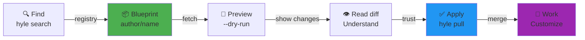
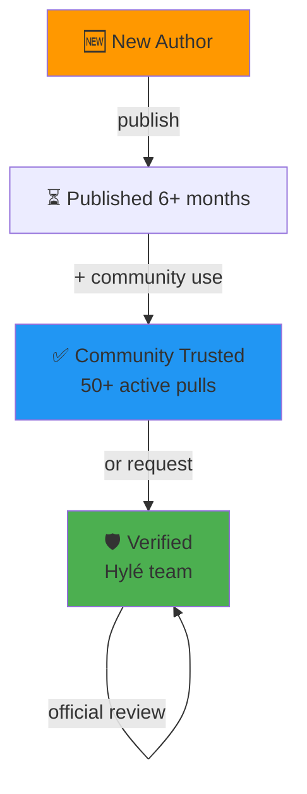
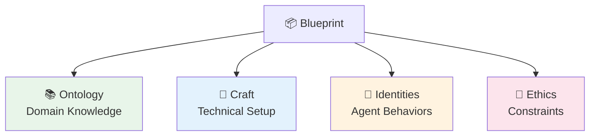

# Core Concepts

_Blueprints as Refined AI Knowledge_

## From Experiment to Blueprint

For traditional software, you write code, compile, ship. For AI-powered projects, you
write **natural language files**: CLAUDE.md contexts, agent definitions, specs, policies. This verbatim
is your **framework** — it shapes how the AI behaves, what it knows, what it can do.

But natural language requires something code doesn't: **iteration through dialogue**. You draft a
CLAUDE.md, talk to the AI, watch how it behaves, refine the text. Repeat. The verbatim
gets better. The AI's behavior converges toward what you want. When it's polished — when
you know it works — that's when it's worth sharing.

A **blueprint** is this refined, tested framework. It's the artifact after the trial and
error. Tested by its author. Vetted by the community. Ready to give other developers a
head start.

## Quick Navigation

| Concept | See |
|---|---|
| What a blueprint IS | [From experiment to blueprint](#from-experiment-to-blueprint) |
| Why four domains matter | [Four domains](#four-domains-what-goes-where) |
| How to get started | [Blueprint → Your project](#blueprint--your-project) |
| Publishing your work | [Publishing guide](publish/index.md) |
| Building trust | [Community credibility](#community-credibility-tiers) |
| LLM choice | [Model compatibility](#model-compatibility-what-you-tested) |
| When to bump versions | [Publish decision tree](#publish-decision-tree-snapshot-vs-push-vs-release) |

## Blueprint → Your Project



You're not installing a binary. You're **adopting curated specifications**. You review it
before merging. You understand what's changing. You keep it in git history.

---

## Community Credibility Tiers

As an author shares blueprints, the community validates your work. This isn't gatekeeping.
It's the same way developers trust well-maintained open-source libraries: track record,
usage, community feedback.



**What each tier means for you as a user:**

- **🆕 New** — First blueprint. No usage data yet. Review more carefully. Author is
  learning.
- **✅ Community** — 50+ developers are using this. It's been tested in production.
  Author responds to feedback. Safe to depend on.
- **🛡️ Verified** — Hylé team reviewed. Author maintains actively. You can cite this
  in team decisions, RFCs, architectural docs. Enterprise-grade.

**Building trust as an author?** See the [Publishing guide](publish/index.md#registry-safety--trust)
for the concrete checklist — publish cadence, responding to flags, documentation.

---

## Four Domains: What Goes Where

When you iterate on markdown, you're actually refining four different kinds of
knowledge. Blueprints organize these separately so they can be reused, combined,
and tested independently.



### Ontology: What the AI Needs to Know

Context, specs, patterns, domain knowledge. Anything that teaches the AI about your
problem space.

- CLAUDE.md — Project background, constraints, decisions
- spec.pdf — API contract, business rules
- architecture.md — System design, key components
- architecture patterns — Domain-specific techniques

### Craft: How to Build It

Dependencies, tools, infrastructure, integrations. Technical setup.

- package.json — Dependencies (language, frameworks)
- .mcp.json — MCP server config (what the AI can call)
- Dockerfile / deployment scripts — How to run it
- CI/CD workflow — How to test

### Identities: Who the AI Is

Agent definitions, personas, behavioral constraints, role-specific instructions.

- AGENTS.md — Agent descriptions, capabilities
- .claude/agents/*.md — Specific agent personalities + guardrails
- prompt templates — Role-specific patterns (code reviewer, architect, etc.)

### Ethics: What the AI Cannot Do

Policies, compliance, data handling, legal constraints.

- PRIVACY.md — Data retention, anonymization rules
- .cedar files — Access control policies
- Security audit — Compliance checklist
- Content policies — What's off-limits

**Key principle:** Domains are **orthogonal**. A file belongs in exactly one. This
separation matters because:

- You can **reuse ontology** (Java coding knowledge) across different craft setups
  (Gradle, Maven, etc.).
- You can **swap identities** (switch from "code reviewer" to "architect") without
  changing domain knowledge.
- Ethics **layers on top** — same constraints whether identity is a reviewer or mentor.

When you pull a blueprint, you're often mixing: you want *their* Java ontology, *your*
craft setup, *a different* identity. The four domains make this surgical.

---

## Model Compatibility: What You Tested

Your markdown was refined and tested against specific models. When you pull a blueprint,
you're not just getting someone's code — you're leveraging the testing they did.

"I tested this agent definition with Claude Sonnet, and it's solid" is valuable
information. Different models have different strengths. An agent prompt tuned for
reasoning might excel on Opus but stumble on Haiku.

Blueprint authors declare which LLMs they tested via a `recommendations` block —
categories (universal, budget, offline, advanced, harness), declaration syntax, and
how to search by tag: [Metadata: tags & models](knowledge/metadata.md).

**Why this matters:** You're not guessing whether a blueprint will work with your model
choice. The author already knows. If they tested it, trust compounds. If they didn't
test on your target model, you know to validate yourself before depending on it.

---

## Publish Decision Tree: snapshot vs push vs release

Your blueprint evolves. So does how you share it.

**`hyle snapshot`** — You're still refining. Not ready for production use. Useful for
asking for early feedback in your team or from trusted reviewers. Not listed on the
public registry.

**`hyle push`** — You've tested. Documented. Fixed bugs. API is stable. Other
developers can depend on it. Backwards-compatible. Bump minor version. List on registry.

**`hyle release`** — Breaking change. You removed an agent, renamed core files, or
rewired the craft layer in a way old blueprints can't use directly. Developers upgrading
need to know. Bump major version. Announce migration path.

**Quick reference:**

```
Only docs/examples changed?          → hyle push (stable, minor bump)
New agent added, old still work?     → hyle push (feature, minor bump)
Removed an agent or renamed files?   → hyle release (breaking, major bump)
Still experimenting, not ready?      → hyle snapshot (WIP, not listed)
```

