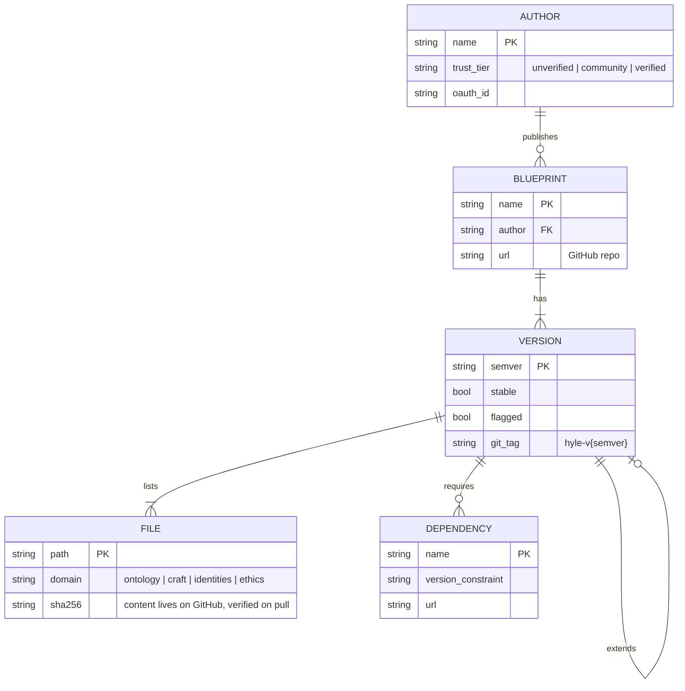

# Hylé Architecture & Design Decisions

Architectural principles, design trade-offs, and known issues.

**Quick Links:**
- [BACKLOG.md](../BACKLOG.md) — Possible evolutions (unreleased / WIP)
- [SECURITY_AUDIT.md](SECURITY_AUDIT.md) — Threat model, P0-P10 findings
- [DEPLOYMENT.md](DEPLOYMENT.md) — Operations, monitoring, runbooks
- [RELEASE_CHECKLIST.md](RELEASE_CHECKLIST.md) — Pre-ship checklist
- [CONTRIBUTING.md](CONTRIBUTING.md) — Dev setup, testing, PR workflow

---

## System Architecture

```mermaid
graph LR
    CLI["CLI<br/>Bun+TypeScript<br/>commands/"]
    Config["Config<br/>.hyle<br/>hyle.yaml"]
    RegistryAPI["Registry API<br/>Bun HTTP<br/>handlers/"]
    GitHubRaw["GitHub<br/>raw.githubusercontent.com<br/>blueprint files"]
    WebUI["Web UI<br/>Angular<br/>search/detail"]
    GitHub["GitHub OAuth"]
    Resend["Resend<br/>email service"]
    
    CLI -->|read/write| Config
    CLI -->|publish,pull,<br/>search| RegistryAPI
    RegistryAPI -->|fetch files| GitHubRaw
    RegistryAPI -->|verify author| GitHub
    RegistryAPI -->|send notifications| Resend
    WebUI -->|search,fetch| RegistryAPI
    WebUI -->|auth| GitHub
    
    style CLI fill:#42b983
    style RegistryAPI fill:#42b983
    style WebUI fill:#35495e
    style GitHub fill:#000
    style Resend fill:#ffc40e
    style GitHubRaw fill:#000
```

---

## Data Model

What the registry actually stores. Key principle: **the registry holds metadata +
checksums only — file content lives on the author's GitHub** and is verified against
`sha256` on every pull.

- `name + author + semver` is the uniqueness key the registry enforces.
- `extends` is self-referential and capped at depth 2 (no grandparent chains).
- `FILE.domain` is exactly one of the four — see [Four domains](../CONCEPTS.md#four-domains-what-goes-where).

---

## Architectural Constraints

1. **Core CLI is programmatic only**: no LLM required, no network call on every command, fast and scriptable
2. **Config lives in project or global `.hyle`**: not in `hyle.yaml` (manifest is for publishing)
3. **Four domains are orthogonal**: ontology (knowledge), craft (technical), identities (personas), ethics (constraints). A file belongs to exactly one domain
4. **Inheritance depth ≤ 2**: prevents opaque dependency chains
5. **Security is defense-in-depth**: scans + author tiers + pull warnings + user review (no single gate)
6. **GitHub is the file store**: Blueprints live on publishers' GitHub repos. Hylé registry stores only manifests + per-file checksums. On pull, files are fetched directly from GitHub (raw.githubusercontent.com)
7. **Publisher must own a GitHub repo**: A public GitHub repo is required to publish. The repo link is auto-detected from `git remote` (no extra setup after first push)
8. **Registry publish history is public**: publish history always visible, including flagged versions with reasons

---

## See Also

- [Core concepts](../CONCEPTS.md) — diagrams: pull/publish flows, domains, trust, models
- [CONFIG.md](CONFIG.md) — configuration + manifest field reference
- [KNOWN_LIMITATIONS.md](KNOWN_LIMITATIONS.md) — current constraints
- [SECURITY_AUDIT.md](../security/SECURITY_AUDIT.md) — threat model, P0–P10 findings
- [DEPLOYMENT.md](../operations/DEPLOYMENT.md) — operations (incl. quick start)
- [BACKLOG.md](../BACKLOG.md) — possible evolutions
